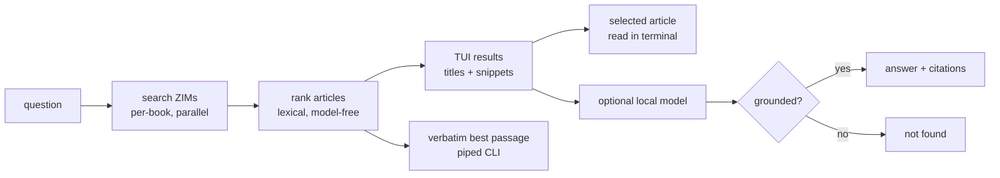

# tny

A fully offline terminal search engine. No network, no API key, no telemetry: default output is
verbatim evidence from ZIM corpora on your own disk. Optional local-model synthesis cites the
articles it used.

```
$ tny "how do I create a swap file"
<the best matching passage from a local ZIM, verbatim>

  1 Arch Wiki · Swap   0.3s
```

Run it with no question for the search-first interface: ranked titles and snippets, an in-terminal
article reader, and optional local-model synthesis.

## Install

Needs `kiwix-serve` (kiwix-tools) on `PATH` for default evidence mode. `llama-server` (llama.cpp)
is needed only for `--fast` or slower synthesis modes; tny starts and supervises both when used.

```sh
nix-shell -p llama-cpp kiwix-tools     # or: pacman -S llama.cpp kiwix-tools
cargo build --release
./target/release/tny --corpus pack small     # ~10 books, downloads to ~/.local/share/tny
```

Model weights and ZIMs live in one fixed place, `${XDG_DATA_HOME:-~/.local/share}/tny/`, so a
question searches the same corpus from any directory (F77). The model downloads only when a
synthesis mode first needs it.

## Using it

```
tny "question"          instant evidence, then the interface
tny --fast "question"    grounded local-model synthesis
tny --corpus search bash        find ZIMs in the kiwix library
tny --corpus add devdocs_en_bash    download one
tny --corpus pack mini|small|medium|large|huge     download a shelf
tny --corpus update     check for newer editions
```

Piped output is plain text, so `tny q > file` and scripts behave like any other command.

### Three dials

Speed, length and model are independent, and what you pick in the interface is what you get
next time (`~/.cache/tny/prefs`).

| speed | reads | typical |
|---|---|---|
| `--ultrafast` | best passage from the page, **no model (default)** | 0.25 s |
| `--fast` | one article, local-model synthesis | ~14 s |
| `--medium` | three articles, local-model synthesis | ~39 s |
| `--slow` | three articles, twice as deep | ~50 s |
| `--molasses` | three articles, as deep as it gets | ~90 s |

Default stops at verbatim evidence. `--fast` and slower modes opt into synthesis. Those are
ceilings, not costs: generation starts with one article and two sections and only re-reads at
the full budget when grounding rejects the first attempt (F82).

`--low` / `--max` set generated-answer length (one sentence / up to three paragraphs).
`--model 0.8b|2b|4b|<hf repo:quant>` selects the synthesis model. Bigger is not automatically
better here — see `NOTES.md`.

### Keys

Modal, like vim. `i` searches, `Esc` drives.

```
i / a       search                    j k ^D ^U gg G   scroll preview/article
J / K       previous/next result      1-9              select result
Enter       read article in TUI       /                find in expanded article
n / N       next/previous match       o                open article in browser
h           toggle query highlights   + -              speed
O           new topic                 < >              generated-answer length
r           repeat current mode       :model 4b        switch synthesis model
:q          quit
```

Fresh TUI starts in ultrafast search mode. Results stay compact; selecting one loads a passage
from its actual article into the larger preview pane instead of trusting noisy search metadata.
Cross-corpus body-only coincidences stay out of that visible shortlist. Matching query terms are
highlighted by default; `h` toggles highlighting. Result navigation stops at first and last
entry. `Enter` loads article paragraphs, headings, lists, and code while omitting navigation and
infoboxes; `/pattern`, `n`, and `N` search it. `o` opens the original in a browser.
Press `+`, then `r`, to generate locally from the selected source. Press `Esc` before `r` to
synthesize from normal top-ranked results instead.
Changing speed, answer length, or model cancels current work; an active supervised model process
is stopped rather than allowed to finish stale output.

## How it works



The model never *selects* anything — ranking, query building and section choice are
deterministic rules, all of which beat the model when measured. In default mode no model runs:
tny prints source text. In synthesis modes the model only paraphrases what it was handed, and a
regex grounding check rejects any answer containing a flag, path or version that is not in the
source text.

## Where it stands

Measurements below come from `bench/`; each guard pins its configuration (F105).

| what it measures | command | current |
|---|---|---|
| deterministic rules and UI helpers (no servers, no network) | `cargo test` | **29/29** |
| is the right article retrieved | `bun bench/rank-cli.mjs` | rank-1 **37/58**, in shortlist **51/58** |
| cross-domain retrieval, frozen before first run | `bun bench/cross-domain-cli.mjs` | rank-1 **25/40**, top-8 **34/40** |
| is the fact in the context handed to the model | `bun bench/ctx-cli.mjs` | 48/58 — **stale, F109 changed the context** |
| is the answer right, end to end | `bun bench/answer-cli.mjs --regrade` | **35/58** correct, 4 refused, **19 wrong** |
| title-path holdout | `bun bench/holdout-cli.mjs` | installed subset **22/41** rank-1, **26/41** shortlist |

The 58-case results use the documented 18-ZIM corpus. F116's newer cross-domain run used the
currently installed 11-ZIM corpus. Both are CPU-only.

### What is honestly weak

- **Default is fast and safe.** Ultrafast mode returns verbatim evidence in about 0.3 s here and
  never invents commands. Synthesis modes remain 14–90 s on CPU.
- **19 of 58 generated answers are confidently wrong**, and that is the number that matters for
  a tool that prints shell commands. It more than doubled when man pages joined the corpus (F92):
  refusals fell 8 → 4 and wrong answers rose 8 → 19. A refusal is the *designed* failure — the
  grounding check rejects any answer whose commands or paths are not in the source — and the
  corpus change traded the safe failure for the dangerous one.
- **35/58 is the honest generated-answer number** (F108: the graders were audited case by case
  and three of them were passing answers that name no runnable command). The gap is mostly
  *selection*: in 43 of 58 cases the answer is already a single sentence in the retrieved text
  (F79), and no selector tried — lexical, bi-encoder, two cross-encoders — picked it better
  than the model does.
- **Bigger models do not fix it.** 4B: half the wrong answers, 3.7× the wall clock, two fewer
  correct, does not fit in 8 GB (F107). 2B: no better (F90). 350M: twice as wrong (F81).
- **A 58-case fixture cannot resolve small differences.** Regrading identical cached answers
  has moved the total by 8 cases (F74) and by 1 (F108), so nothing smaller than that is a
  result. It was also authored here against this corpus, and `holdout-cli` no longer pretends
  to counter that: it used to query each page by its own title and check whether the title came
  back, which measures whether the index is alive (F110). **There is no generalisation evidence
  in this repo** until someone writes questions without looking at the pages.

## The measurements

- **`NOTES.md`** — 108 findings, each with the numbers behind it. Read this first; where the
  three documents disagree, it wins.
- **`PLAN.md`** — the design and the reasoning. Every decision cites a finding.
- **`bench/`** — the guards in the table above, plus `harness.mjs` for the pre-Rust work.

Headlines:

- **The corpus is the lever, not the model.** Same model, same questions: 3/6 from weights,
  6/6 with retrieval — and it converts confident fabrications (`mkfs -xfs -f` "to encrypt a
  partition") into correct commands.
- **Grounding is a regex, not a bigger model.** It buys 2B's entire measured advantage.
- **More context is not more accuracy.** A wider window around a flag pulls in the
  *neighbouring* flag and the model reports its meaning instead (F100).
- **The model must never select.** Ranking, query building and section choice are all done
  better by deterministic rules; every arm that let the model choose scored worse (F16, F79).
- **Retrieval is 2 % of the wall clock.** Prefill is 85-90 % of it, which is why the speed
  dial is a context-size dial.
