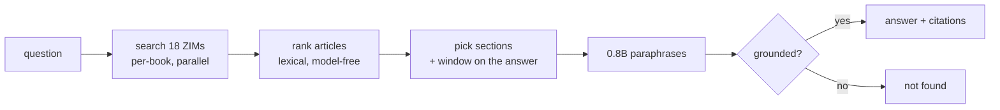

# tny

A fully offline terminal search engine with a small model as the front end. No network, no
API key, no telemetry: every answer comes from ZIM corpora on your own disk, and every answer
cites the articles it was built from.

```
$ tny "how do I create a swap file"
Use mkswap(8) to create a swap file of the size you want, activate it with `swapon`, and add
it to /etc/fstab to keep it across reboots.

  1 Arch Wiki · Swap   38.7s
```

Run it with no question for the full interface — a scrolling transcript, the shortlist of
everything retrieved, and vim keys to drive it.

## Install

Needs `llama-server` (llama.cpp) and `kiwix-serve` (kiwix-tools) on `PATH`; tny starts and
supervises both itself.

```sh
nix-shell -p llama-cpp kiwix-tools     # or: pacman -S llama.cpp kiwix-tools
cargo build --release
./target/release/tny --corpus pack small     # ~10 books, downloads to ~/.local/share/tny
```

Model weights and ZIMs live in one fixed place, `${XDG_DATA_HOME:-~/.local/share}/tny/`, so a
question answers the same from any directory (F77). The 0.8B model downloads on first use.

## Using it

```
tny "question"          one answer, then the interface
tny --corpus search bash        find ZIMs in the kiwix library
tny --corpus add devdocs_en_bash    download one
tny --corpus pack mini|small|medium|large|huge     download a shelf
tny --corpus update     check for newer editions
```

Piped output is plain text, so `tny q > file` and scripts behave like any other command.

### Three dials

Speed, length and model are independent, and what you pick in the interface is what you get
next time (`~/.cache/tny/prefs`).

| speed | reads | typical |
|---|---|---|
| `--ultrafast` | best passage from the page, **no model** | 0.25 s |
| `--fast` | one article | ~14 s |
| `--medium` | three articles (default) | ~39 s |
| `--slow` | three articles, twice as deep | ~50 s |
| `--molasses` | three articles, as deep as it gets | ~90 s |

`--low` / `--max` set answer length (one sentence / up to three paragraphs).
`--model 0.8b|2b|4b|<hf repo:quant>` picks who answers. Bigger is not automatically better
here — see `NOTES.md`.

### Keys

Modal, like vim. `i` types a question, `Esc` drives.

```
i / a       ask                      j k ^D ^U gg G   scroll
1-9         pick a source            ⏎                read it (skips retrieval)
r           ask that again           + -              speed
o           new topic                < >              length
:model 4b   switch model             :q               quit
```

Picking a source is the important one: the answer is built from the top articles, and when
it lands on the wrong one, the right page is usually already on screen a keypress away.

## How it works



The model never *selects* anything — ranking, query building and section choice are
deterministic rules, all of which beat the model when measured. It only paraphrases what it
was handed, and a regex grounding check rejects any answer containing a flag, path or version
that is not in the source text.

## The measurements

- **`NOTES.md`** — 104 findings, each with the numbers behind it. Read this first.
- **`PLAN.md`** — the build sequence. Every decision cites a finding.
- **`bench/`** — the harnesses. `bun bench/harness.mjs ground` is a pure self-test: 23 cases
  pinning the grounding rules, no servers, no network.

Headlines:

- **The corpus is the lever, not the model.** Same model, same questions: 3/6 from weights,
  6/6 with retrieval — and it converts confident fabrications (`mkfs -xfs -f` "to encrypt a
  partition") into correct commands.
- **Grounding is a regex, not a bigger model.** It buys 2B's entire measured advantage.
- **More context is not more accuracy.** A wider window around a flag pulls in the
  *neighbouring* flag and the model reports its meaning instead (F100).
- **Retrieval is 2 % of the wall clock.** Prefill is 85-90 % of it, which is why the speed
  dial is a context-size dial.
